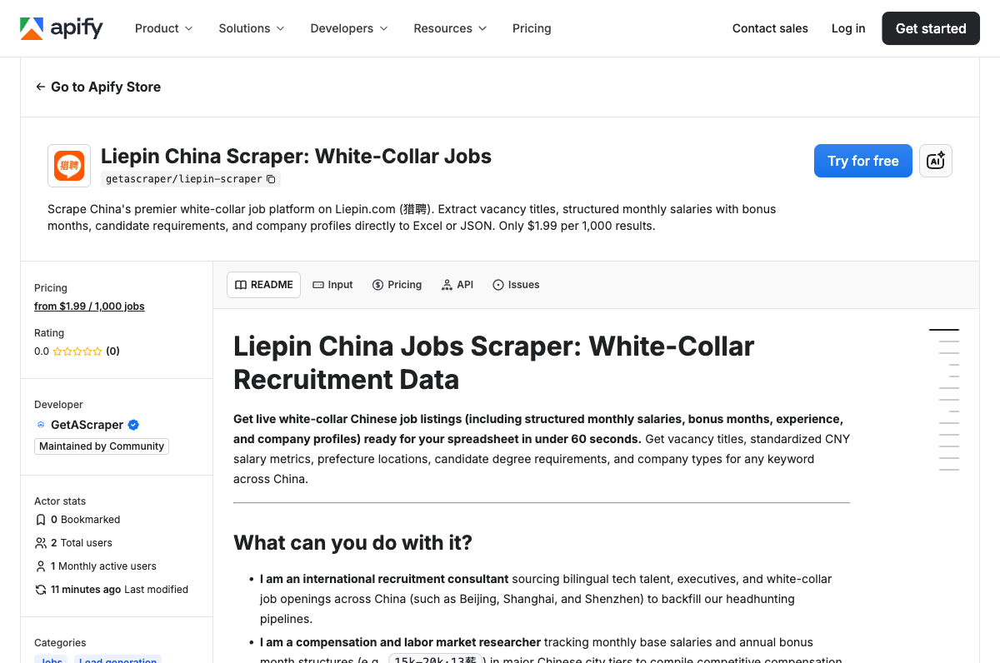

<h1 align="center">Liepin Scraper | China White-Collar Jobs | Apify Actor</h1>

<p align="center">
  <a href="https://apify.com/getascraper/liepin-scraper"></a>
  <a href="https://github.com/getascraper/how-to-scrape-liepin"></a>
  <a href="https://github.com/getascraper/how-to-scrape-liepin"></a>
  <a href="https://github.com/getascraper/how-to-scrape-liepin"></a>
  <a href="https://apify.com/getascraper/liepin-scraper"></a>
</p>

<p align="center">
  <strong>Liepin scraper and Chinese white-collar job data extraction API.</strong> Extract jobs with monthly CNY salaries, bonus months (13薪, 16薪), recruiter data, and company profiles from liepin.com with this Apify Actor. Bilingual Chinese/English output. Free tier included.
</p>

<p align="center">
  <strong>Price: $1.99 per 1,000 results</strong>
</p>

<p align="center">
  
</p>

## What does Liepin Scraper do?

The **Liepin Scraper** extracts white-collar job listings from **Liepin** (liepin.com), China's #2 professional recruitment platform. It captures the unique salary structures that make Liepin different from other job boards.

It extracts:
- **Monthly CNY salaries** with **bonus months** (e.g., 15k-20k·13薪 => 15000-20000 monthly, 13 months/year)
- **Annual salary estimates** computed from base + bonus months
- **Bilingual field translations** (Chinese to English for degrees, company types, experience)
- **Company profiles** (type, size, industry)
- **Degree and experience requirements**
- **Predictable URL extraction** from listing cards

## Why use Liepin Scraper?

- **International Recruitment:** Source bilingual tech talent, executives, and white-collar job openings across China.
- **Compensation Research:** Track monthly base salaries and annual bonus month structures in major Chinese city tiers.
- **B2B Lead Generation:** Extract hiring companies, corporate registration types, and headcount sizes to build targeted sales databases.

## How to use Liepin Scraper

1. Create a free Apify account.
2. Open the **Liepin China Jobs Scraper** in the Apify Store.
3. Select your target city (e.g., Beijing, Shanghai, Shenzhen) or Featured Snapshots.
4. Enter an optional keyword (e.g., python, 产品经理, AI).
5. Click **Start** and download the dataset as JSON, CSV, or Excel.

## Input Parameters

| Field | Default | Description |
| scrapeMode | home | Choose how to discover jobs: home grabs today's featured jobs (fastest), search filters by keyword. |
| keyword | python | Search keyword (e.g., AI, 产品经理, Golang). Ignored when scrapeMode is home. |
| city | 010 | Filter by city codes (Beijing 010, Shanghai 020, Guangzhou 030, Shenzhen 040). |
| pagesPerQuery | 3 | How many search result pages to walk through (up to 40 jobs per page). |
| includeJobDetail | true | Visit each job's detailed page to extract full description. |
| maxItems | 50 | Maximum number of job records to extract. |

## Output Structure

```json
{
  "sku": "1983197685",
  "productId": "1983197685",
  "url": "https://www.liepin.com/job/1983197685.shtml",
  "title": "艺术总监",
  "companyName": "上海博盟文化发展有限公司",
  "salaryRawText": "15-18k·13薪",
  "minSalaryMonthlyCny": 15000,
  "maxSalaryMonthlyCny": 18000,
  "bonusMonths": 13,
  "annualEstimateCny": 214500,
  "salaryDisclosed": true,
  "currency": "CNY",
  "degreeRequired": "Bachelor's",
  "companyType": "Private Enterprise",
  "experienceRequired": "3-5 Years",
  "city": "上海",
  "province": "上海",
  "region": "上海",
  "address": "上海-航华",
  "scrapedAt": "2026-06-10T13:00:00.000Z"
}
```

## Output Fields

| Field | Description |
| sku | Unique identifier of the job vacancy. |
| url | Direct public job detail link. |
| title | Job title. |
| minSalaryMonthlyCny | Standardized minimum monthly salary in Yuan (CNY). |
| maxSalaryMonthlyCny | Standardized maximum monthly salary in Yuan (CNY). |
| bonusMonths | Number of salary payment months per year (e.g., 13薪 = 13). |
| annualEstimateCny | Computed estimated annual salary in Yuan (CNY). |
| degreeRequired | Standardized degree requirements (Bachelor's, Master's, PhD, Any Degree). |
| companyType | Standardized company type (Private Enterprise, State-Owned, Foreign-Owned). |
| experienceRequired | Standardized required experience band (1-3 Years, 3-5 Years, etc.). |
| scrapedAt | ISO timestamp of when the listing was saved. |

## Cost

Pricing is pay-per-result. Empty runs cost nothing.

- **Rate: $1.99 per 1,000 results** ($0.00199 per result).
- 100 listings typically cost $0.20.
- 1,000 listings cost exactly $1.99.
- 10,000 listings cost exactly $19.90.

## Tips

- **Predictable URL Extraction.** Liepin job detail URLs always follow a strict format: https://www.liepin.com/job/1{jobid}.shtml. The Actor extracts and queues details seamlessly with zero DOM fragility.
- **Bilingual Translations.** The Actor automatically translates Chinese recruitment specifications (degrees like 本科 or 硕士, company types like 民营 or 上市公司) into standardized B2B English fields.
- **Disable detail fetches for fast sweeps.** Turn off includeJobDetail to skip detailed pages, cutting execution speed by 10x and saving proxy bandwidth.

## FAQ

**Does it get blocked by Liepin?**
No. The scraper supports premium, rotating residential proxies with Singapore, Hong Kong, or Japan country codes to avoid geoblocking.

**Does it extract private contact details?**
No. The scraper only extracts public vacancies, salaries, degree requirements, and corporate profiles. No private recruiter or candidate data.

**How fresh is the data?**
Extremely fresh. The scraper parses sitemaps and search pages in real-time, fetching the latest vacancies posted on Liepin.

**Are all categories supported?**
Yes. All major white-collar occupations including IT, Web Engineers, Consulting, Sales, Marketing, and Project Management.

## Related scraping tools

- [Zhaopin Scraper](https://github.com/getascraper/how-to-scrape-zhaopin) - Chinese jobs with CNY salaries and geolocations
- [Lagou Scraper](https://github.com/getascraper/how-to-scrape-lagou) - Chinese tech jobs with monthly salaries
- [58.com Scraper](https://github.com/getascraper/how-to-scrape-58-classifieds) - Chinese real estate listings
- [BizReach Scraper](https://github.com/getascraper/how-to-scrape-bizreach) - Japan executive jobs with CEO leads
- [Wantedly Scraper](https://github.com/getascraper/how-to-scrape-wantedly) - Japanese startup jobs with mission data

## Support

- Open an issue at https://github.com/getascraper/how-to-scrape-liepin/issues
- Contact us through the Apify Console

---

*Built with the Apify SDK and Playwright. Optimized for Chinese white-collar recruitment data extraction at scale.*
